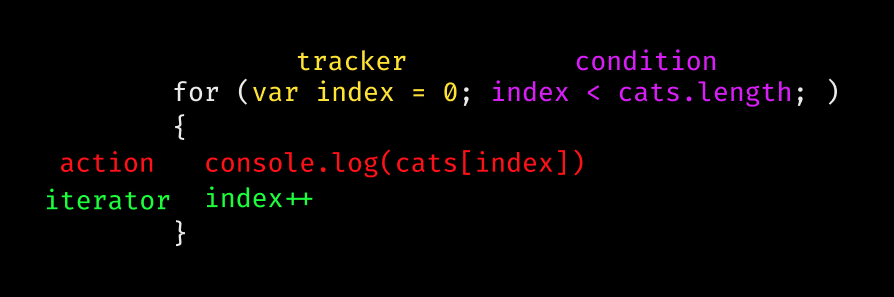

# {{$frontmatter.title}}

## Loops

**What are loops?**

Sometimes in programming land, we want to run a piece of code multiple times.
Instead of calling it many many times manually, we create a loop to run it 
as many times as we explicitly state. In this course we will talk over JavaScript's
`for` loop.

**Let's take an example** 

We have an array of many cat names called cats, we want to 
console.log the name for every cat inside that box.

```js
var cats = [
  "Jimmy",
  "Timmy",
  "Fred",
  "Pickles",
  "Rover",
  "Frankie",
  "Snowball",
  "Johnny"
]
```

There are two ways we can do this - the manual way and the loopy way!

- Manual way: console.log() every cat individually.
 
```js
// loops-ex-01 TODO: ADD URL
// There are 8 cats, so we will need to log it 8 times.
console.log(cats[0])
console.log(cats[1])
console.log(cats[2])
console.log(cats[3])
console.log(cats[4])
console.log(cats[5])
console.log(cats[6])
console.log(cats[7])
```

- The automated loopy way: We want to log out as many cats

```js
// loops-ex-02
// We want to console.log out all the cats! We dont need to know exactly how many cats
for (var index = 0; index < cats.length; ) {
  console.log(cats[index]);
  index++;
}
```

## Let's break it down

Parts of a `for` loop



- **tracker**: Which cat we're on.
- **condition**: When do we keep going?
- **action**: What do we do every time?
- **iterator**: How we give credit that we've finished a loop

## Quiz

1. **T/F: for loops can only do one thing in the action section**
2. **Why do we start our tracker at 0?**
  <ol type="a">
    <li> We can only start at 0</li>
    <li> We can start at any number but we start at 0 because thats how we count indexes
    and this is obviously the right answer because it's so long.
    </li>
    <li> You shouldn't start at 0</li>
  </ol>
3. **What will happen if you forget to add an interator**
  <ol type="a">
    <li> It will loop forever</li>
    <li> Nothing. </li>
    <li> It will break your code, browser, and possibly even your PC</li>
  </ol>

## Practice

**Below are unfinished JavaScript each of them objects that need to be completed**

The first snippet has a cat object named paws, we want her to meow 5 times using a for-loop!

The second snippet should console.log out true

The third is expecting for you to add every number in the array.

The fourth is an optional, purposely hard problem.

- [first](https://codesandbox.io/s/practice-loops-1-5gbh1)
- [second](https://codesandbox.io/s/practice-loops-2-u20iz)
- [thid](https://codesandbox.io/s/practice-loops-3-sjcty)
- [fourth](https://codesandbox.io/s/practice-loop-3h-jk0ut)
