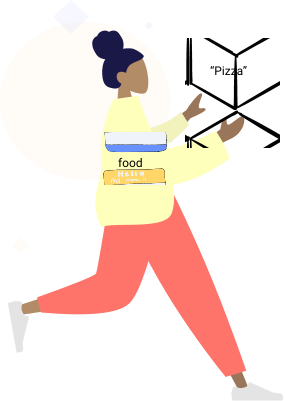

#  {{$frontmatter.title}}

## What are they?

For variables I will use the analogy of a nametag.

Nametags are warn by people and each person can hold one piece of data. In these first examples we will use Strings. 

::: tip
Strings are any characters surrounded by quotation marks("")

Example
```js
"This is a string!" // String
"555555" // String
"There are numbers here but this is still a string 2#%@#$@$!" // String
"true" // String
"variable" // String
```
:::

## Scenario - Creating a variable to equal the string "Pizza"

When we create variables we actually create a nametag for data that's typically much longer. We do this because we can:

- Make things more human readable
- Allows us to reuse the data without remembering what was inside of it



```js
var food = "Pizza"
```

<Quiz-Quiz quiz-name="variable1" />
