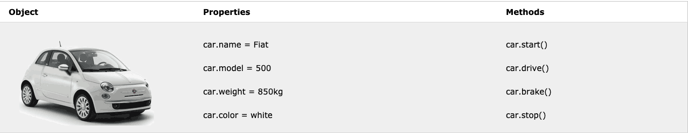
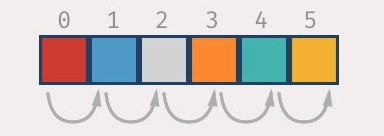

# {{$frontmatter.title}}

## Objects

In real life, anything that you can touch are objects and the same is true in JavaScript! Let's take a car as an example.

Objects like a car can only be defined by two things: 
  - What they have (**properties**)
  - What they can do (**methods**)

Let's keep using the car example:



Let's break down both relations and how to access them.

- **Properties**

   Like we described earlier properties are just things the object has. So in this example we see, this car has a name, model, weight and color.
   
   We see the properties are being accessed using a dot - `car.name, cat.model, etc.`
   
   Okay so how do we write it?
     ```js
     var car = {
       name: "Fiat",
       model: 500,
       weight: "850kg",
       color: "White"
     }
     ```

- **Methods**

  If objects are nouns, think of methods like verbs. It's what they do, it's the exact same thing as functions. 
  
  In the example we see this car has 3 methods: start, drive, brake, and stop and are being
  called with the same dot, except the added the parenthesis to let us know it's a function.
  
  Example: `car.start()`, `car.stop()`, `car.brake()`

  Let's add methods to the previous example

  ```js
  var car = {
    name: "Fiat",
    model: 500,
    weight: "850kg",
    color: "white",
    start: function(){
      // do something
    },
    drive: function(){
      // do something
    },
    brake: function(){
      // do something
    },
    stop: function(){
      // do something
    }
  }
  ```
    
### Quiz

1. Identify whether each field is a prop or a method:

  ```js
    var cat = {
      eyes: 2, //            1 - _____
      name: "catty", //      2 - _____
      mewo: function(){ //   3 - _____
        console.log("Meow")
      }
  ```

2. Choose the correct way to get the number of eyes the cat object has:
  <ol type="a">
    <li> `cat.eyes()` </li>
    <li> `cat.eyes` </li>
    <li> `cat.name()` </li>
    <li> `eyes(cat)` </li>
  </ol>
3. Choose the correct way to change the cat's name to Puck:
  <ol type="a">
    <li> `cat.giveName("Puck")` </li>
    <li> `cat.name = "Puck"` </li>
    <li> `cat.name() = "Puck"` </li>
    <li> `cat.name: "Puck"` </li>
  </ol>
4. Choose the correct way for the cat to meow:
  <ol type="a">
    <li> `cat.meow()` </li>
    <li> `cat.meow` </li>
    <li>  `console.log(cat.meow)` </li>
    <li> `meow(cat)` </li>
  </ol>
5. Functions in objects act differently than normal functions we've worked before
  <ol type="a">
    <li> `True` </li>
    <li> `False` </li>
  </ol>

### Practice

**Below are two unfinished JavaScript each of them objects that need to be completed**

The first app have multiple methods on an object called car. Create the object for the given code to work.

The second problem is calling the method meow and expecting to log out "woof woof".

<p class="practice-title"> Practice Problems </p>

- [first](https://codesandbox.io/s/practice-objects-1-w5udb)
- [second](https://codesandbox.io/s/practice-objects-2-0c8lm)

### Solution

## Arrays

### Introduction

Arrays are boxes that can store many things of any type, not just one like a variable and are denoted by braces `[]`

First let's remember what data types we have worked with until this point:
  - `Boolean` example: `true`, `false`
  - `Number` example: `1`, `2924`, `0.002912`, `2/3`
  - `String` example: `"Hello"`, `"Goodbye"`, `"I can be anything I want~"`
  - `Variable` example: `name`, `iRepresentSomething`, `imDefinedElsewhere`

An array is similar to a variable where it can store information, but unlike a variable it can store an infinite number of things. Let's compare. 

```js
var cat1 = "Benny the Cat"
var cat2 = "Jimmy the Cat"
var cat3 = "Arto the Artistic Cat"
```

In the example above we see three variables - 3 cats. What if we want to group all these cats together into one variable? We use an **array!** We will name this cats.

```js
var cats = [cat1, cat2, cat3]
console.log(cats)
// > ["Benny the Cat", "Jimmy the Cat", "Arto the Artistic Cat"]
```

#### Accessing a specific entry in the area

Arrays are accessed by using the **index** (How arrays count the location of their entries)
and **indexes start counting at 0**



Example: At the start of a race you start at mile 0.

Let's get the second cat of our array.

```js
cats[1]
//> "Jimmy the Cat"
```
#### Methods available with arrays

1. `array.push(item)` - Adds an item to the array at the end.
  ```js
  //example - adding another cat to our list
  cats.push("Piggy the Clean Cat")
  ```
2. `array.shift()` - removes the first item in the array and returns that item
  ```js
  // example
  var cats = [cat1, cat2, cat3]
  cats.shift()
  // > "Benny the Cat"
  console.log(cats)
  // > [cat2, cat3]
  ```
3. `array.pop()` - removes the last item in the array and returns that item
  ```js
  // example
  var cats = [cat1, cat2, cat3]
  cats.pop()
  // > "Arto the Artistic Cat"
  console.log(cats)
  // > [cat1, cat2]
  ```

### Solution

### Quiz

1. T/F Arrays are used to store multiple values of a single type in a variable
2. How would you get the third entry of an array?
3. How would you call array methods?
  <ol type="a">
    <li> `pop(cats)` </li>
    <li> `pop([cats])` </li>
    <li> `cats.pop()` </li>
  </ol>

### Practice

**Below are two unfinished JavaScript each of them objects that need to be completed**

The first expects problem expects to console out `true` without directly adding to the array.

<p class="practice-title"> Practice Problems </p>

- [first](https://codesandbox.io/s/practice-arrays-1-3zu5s)

### Homework

Add history to calculator solution

